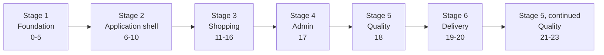
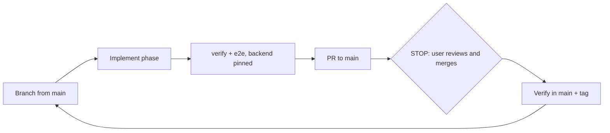

# EcomDemo Web: Learning Roadmap

The storefront and admin console for the EcomDemo backend, **one technology per phase**, built by Claude Code with the user as tech lead, learner and shop owner. Its own repository (`EcomDemo-Web`), its own phases from Phase 0, the backend's rules. The roadmap follows `docs/backend/integration-guide.md` ("Frontend roadmap: Phase 0 to 23"), with one change recorded in `docs/decisions.md`: Phase 9 ports the EcomDemo design system instead of Tailwind CSS + Radix.

> **Claude Code:** don't read this file in full. Edit only the tracker row of the current or previous phase. Everything you need is in `CLAUDE.md` and the files it points to.

## Start here (user)

1. Read `docs/process/your-role.md`.
2. Complete the setup checklist there.
3. Paste the kickoff prompt from `docs/process/kickoff-and-commands.md` into Claude Code.

## Package map

```
EcomDemo-Web/
├── CLAUDE.md                          # auto-loaded rules + pointers (Claude Code entry point)
├── design-system/                     # the approved EcomDemo design system (ported in Phase 9)
└── docs/
    ├── ROADMAP.md                     # this file: overview + progress tracker
    ├── KNOWN_ISSUES.md                # defects, gaps, candidates; backend gaps this app adapts to
    ├── decisions.md                   # long-lived decision log
    ├── backend/
    │   └── integration-guide.md       # the backend contract (written by the backend side, 2026-09-30)
    ├── process/                       # execution (with the fix track), git, testing, context, environment, role, kickoff
    ├── phases/                        # phase-00 … phase-23 (only the current one is read)
    ├── progress/                      # CURRENT.md, RECENT.md, archive/
    ├── architecture/                  # routing, state, API layer, auth flow, design system
    ├── modules/                       # one page per feature folder
    └── test-reports/                  # phase-XX.md + screenshots
```

## The journey at a glance



## The phase cycle



Fixes for known defects (`fix/ki-XXX-<slug>`) run between phases, one at a time, with the same PR, stop and verification rules (`docs/process/execution-protocol.md`, section 8).

## Progress tracker

Status: ⬜ Not started · 🟡 In progress · 🔵 PR open · ✅ Done (verified in `main`, tagged) · ⏭️ Skipped (user's choice, no tag)

| # | Phase | Technology | Branch | Stage | Needs from the backend | Status |
|---|---|---|---|---|---|---|
| 0 | [Repository Bootstrap](phases/phase-00-repo-bootstrap.md) | Git + GitHub + GitHub CLI | `main` | Foundation | none | ✅ |
| 1 | [Baseline App](phases/phase-01-baseline-app.md) | Vite + React + TypeScript (strict) | `feature/phase-01-baseline-app` | Foundation | product list from `GET /api/products` via the dev proxy | ✅ |
| 2 | [Automated Testing](phases/phase-02-testing.md) | Vitest + Testing Library + MSW | `feature/phase-02-testing` | Foundation | none (the API is mocked) | ✅ |
| 3 | [End-to-End Smoke Tests](phases/phase-03-playwright.md) | Playwright | `feature/phase-03-playwright` | Foundation | backend compose stack at the pinned tag | ✅ |
| 4 | [Code Quality](phases/phase-04-code-quality.md) | ESLint + Prettier | `feature/phase-04-code-quality` | Foundation | none | ✅ |
| 5 | [Continuous Integration](phases/phase-05-github-actions.md) | GitHub Actions | `feature/phase-05-github-actions` | Foundation | backend images for the E2E job (GHCR) | ✅ |
| 6 | [Routing](phases/phase-06-routing.md) | React Router | `feature/phase-06-routing` | Application shell | none | ✅ |
| 7 | [Typed API Client](phases/phase-07-api-client.md) | openapi-typescript + openapi-fetch | `feature/phase-07-api-client` | Application shell | the five `/v3/api-docs/<service>` documents | ✅ |
| 8 | [Server State](phases/phase-08-server-state.md) | TanStack Query | `feature/phase-08-server-state` | Application shell | none | ✅ |
| 9 | [Design System](phases/phase-09-design-system.md) | CSS custom properties + the EcomDemo component library | `feature/phase-09-design-system` | Application shell | a decision on product images (web KI-002) | ✅ |
| 10 | [Forms and Validation](phases/phase-10-forms.md) | React Hook Form + Zod | `feature/phase-10-forms` | Application shell | validation rules (guide sections 3, 6, 7) | ✅ |
| 11 | [Authentication](phases/phase-11-auth.md) | JWT in memory + route guards | `feature/phase-11-auth` | Shopping | login, register; no refresh token (backend KI-017) | ✅ |
| 12 | [Cart](phases/phase-12-cart.md) | Mutations + cache invalidation | `feature/phase-12-cart` | Shopping | cart API | ✅ |
| 13 | [Checkout and Order Tracking](phases/phase-13-checkout.md) | Polling a saga (status state machine) | `feature/phase-13-checkout` | Shopping | orders API; saga deadline | ✅ |
| 14 | [Orders and Profile](phases/phase-14-orders-profile.md) | Nested routes + detail views | `feature/phase-14-orders-profile` | Shopping | no password change (backend KI-018) | ✅ |
| 15 | [Semantic Search](phases/phase-15-search.md) | Debounced search + URL state | `feature/phase-15-search` | Shopping | search endpoint; `503` when not configured | ✅ |
| 16 | [AI Shopping Assistant](phases/phase-16-assistant.md) | Chat UI + confirm-before-act | `feature/phase-16-assistant` | Shopping | an LLM configured on the backend | 🟡 |
| 17 | [Admin Console](phases/phase-17-admin.md) | Role-gated area + file upload | `feature/phase-17-admin` | Admin | ADMIN endpoints (guide section 7) | ⬜ |
| 18 | [Accessibility](phases/phase-18-accessibility.md) | axe-core + keyboard testing (WCAG 2.2 AA) + visual regression | `feature/phase-18-accessibility` | Quality | none | ⬜ |
| 19 | [Containerization](phases/phase-19-docker.md) | Docker + nginx (same-origin proxy to the gateway) | `feature/phase-19-docker` | Delivery | same-origin serving (CORS fix not required) | ⬜ |
| 20 | [Container Orchestration](phases/phase-20-kubernetes.md) | Kubernetes (the backend's kind cluster and ingress) | `feature/phase-20-kubernetes` | Delivery | backend k8s manifests and ingress | ⬜ |
| 21 | [Performance](phases/phase-21-performance.md) | Lighthouse CI + bundle budgets | `feature/phase-21-performance` | Quality | none | ⬜ |
| 22 | [Security](phases/phase-22-security.md) | CSP + npm audit + Trivy | `feature/phase-22-security` | Quality | none | ⬜ |
| 23 | [Observability](phases/phase-23-observability.md) | Error reporting + trace propagation | `feature/phase-23-observability` | Quality | `X-Correlation-Id`; backend tracing (Tempo) | ⬜ |
