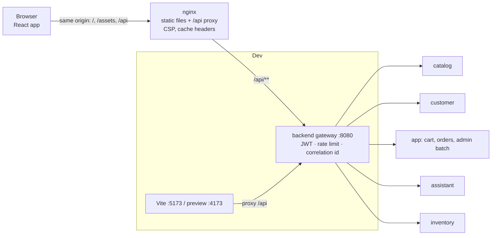

# Architecture

How EcomDemo Web is put together. Each page is written by the phase that builds the part:

| Page | Written in |
|---|---|
| `overview.md` (below, the target) | kept current by every phase that changes it |
| `routing.md` | Phase 6 |
| `api-layer.md` | Phase 7 |
| `state.md` | Phase 8 |
| `design-system.md` | Phase 9 |
| `auth-flow.md` | Phase 11 |

## Target (after Phase 23)



```
src/
├── app/            # entry, providers (query client, session, router), error boundaries, route table
├── components/     # the design system: tokens-based components, forms kit (Phase 9-10)
├── styles/         # tokens.css, fonts
├── api/            # client.ts, errors, generated/ (never edited), MSW handlers for tests
├── content/        # site.ts, notes.ts: words the owner writes (TODO(owner))
├── features/
│   ├── catalog/  auth/  cart/  checkout/  orders/  account/  search/  assistant/  admin/
└── test/
api/openapi/        # committed snapshots of the backend's five OpenAPI documents
e2e/                # Playwright suite (the smoke test from Phase 3)
```

Rules the architecture enforces: components never call `fetch` (hooks in `features/*/api.ts` use the typed client); server data lives in the query cache; one session store holds the token; money is displayed, never computed; every page has a title and one `h1` and works at 360 px.
